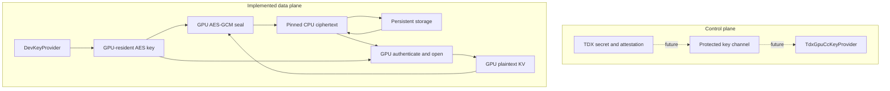

# ConfKV

ConfKV is a research prototype for protecting persistent LLM KV cache
with authenticated encryption. It is built on LMCache and supports
CPU-side and GPU-side AES-GCM data paths.

The current repository focuses on the non-confidential-computing data
plane. TDX attestation and protected TDX-to-GPU-CC key establishment
are reserved as a separate control-plane extension.

## Architecture

ConfKV separates key establishment from KV-cache encryption.



`KeyProvider` is the boundary between these two planes:

- `DevKeyProvider` reads a raw 16-byte test key and provisions GPU key
  handles. It is used for current functional and performance tests.
- `TdxGpuCcKeyProvider` is fail-closed until the attested TDX and GPU
  CC provisioning path is implemented.

The persistent store only receives AES-GCM frames:

```text
[version | 12-byte IV | ciphertext | 16-byte authentication tag]
```

On load, ConfKV authenticates the frame before publishing plaintext KV
back to the inference engine. Authentication failure prevents KV
scatter and zeroizes the failed output.

## Current Scope

Implemented:

- CPU AES-128-GCM baseline and optimized native backend;
- GPU AES-128-GCM seal/open;
- GPU/CPU frame interoperability;
- authentication failure and tamper rejection;
- naive synchronous GPU data path;
- optimized batched and streamed GPU data path;
- LMCache GPU-to-CPU-to-storage integration;
- persistent L2 reload and authenticated GPU restore;
- 4-GPU/8-CPU Qwen end-to-end experiment runner.

Not yet implemented or validated:

- TDX secret generation and remote attestation;
- protected TDX-to-GPU-CC key transfer;
- GPU CC execution;
- end-to-end security against a malicious host.

Results produced without TDX and GPU CC must be described as
**non-CC encrypted data-path performance**, not as end-to-end
confidential-computing results.

## Experiment Cases

| Case | Description |
|---|---|
| `baseline` | Native LMCache without KV encryption |
| `opt_cpu` | CPU AES-128-GCM with the native OpenSSL backend |
| `confkv_naive` | GPU AES-GCM with one slot and synchronous per-chunk execution |
| `confkv_optimized` | GPU AES-GCM with batching, multiple slots and CUDA stream overlap |

The naive and optimized cases use the same AES-GCM frame, key and
workload. Their difference is execution scheduling, allowing the
benefit of ConfKV's data-path optimizations to be isolated.

## Repository Layout

```text
LMCache/
    Pinned ConfKV-modified LMCache runtime

experiments/gpu_kv_seal/
    gpu/       CUDA AES-GCM implementation and Python binding
    native/    Native CPU/OpenSSL AES-GCM implementation
    scripts/   Correctness, security and performance experiments
    configs/   Experiment configurations
```

The original LMCache baseline commit is recorded in:

```text
experiments/gpu_kv_seal/BASELINE_COMMIT
```

## Quick Start

Clone the repository and initialize the LMCache submodule:

```bash
git clone --recursive ssh://git@ssh.github.com:443/MountVeil/ConfKV.git
cd ConfKV
git submodule update --init --recursive
source .venv/bin/activate
source env.sh
```

Build the native CPU and GPU libraries:

```bash
./experiments/gpu_kv_seal/native/build.sh
./experiments/gpu_kv_seal/gpu/build.sh
```

Run the focused unit tests:

```bash
pytest -q \
  LMCache/tests/v1/confkv/test_key_provider.py \
  LMCache/tests/v1/confkv/test_gpu_crypto.py \
  LMCache/tests/v1/confkv/test_store_abort.py
```

Run the non-CC GPU data-plane gates:

```bash
./experiments/gpu_kv_seal/scripts/run_gpu_gates.sh
```

Run the complete 4-GPU/8-CPU Qwen experiment:

```bash
python3 experiments/gpu_kv_seal/scripts/run_qwen_e2e_4g8c.py \
  --repo "$PWD" \
  --model /data/models/Qwen3-8B \
  --gpus 0,1,2,3 \
  --cpus 0-7 \
  --cases baseline opt_cpu confkv_naive confkv_optimized
```

See [experiments/gpu_kv_seal/README.md](experiments/gpu_kv_seal/README.md)
for environment preparation, development-key creation, experiment
parameters and result-file descriptions.

## License

This repository contains a derivative of LMCache and is distributed
under the Apache License 2.0.

See `LICENSE`, `THIRD_PARTY.md` and `MODIFICATIONS.md`.
